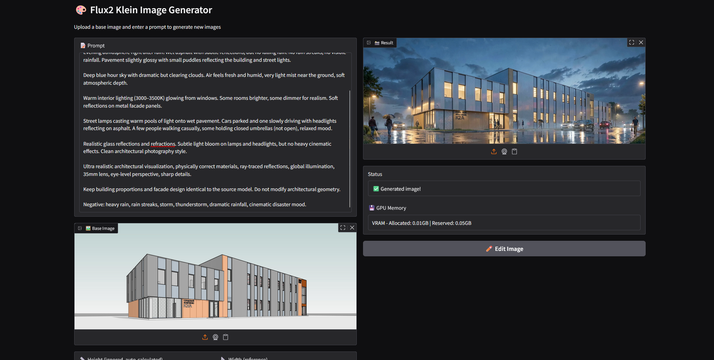

# 🎨 Flux2 Klein Image Generator

A web interface for generating and editing images based on the **Flux2 Klein** model (4B parameters).

## 📖 Description

This tool allows you to:
- **Upload images** and describe desired changes in a text prompt
- **Generate new versions** of images with automatic aspect ratio preservation
- **Iteratively edit** — instantly reuse the result for the next generation
- **Track progress** in real-time with inference step display



### Technical Features:
- Model: `black-forest-labs/FLUX.2-klein-4B` (distilled version)
- Memory optimization: CPU offload for GPU with limited resources
- bfloat16 support (native model format)
- Automatic height calculation based on original aspect ratio
- Memory cleanup after each generation

---

## 🚀 Quick Start

### Requirements:
- Python 3.10+
- GPU with CUDA support (NVIDIA with ≥4GB VRAM recommended)
- ~10GB free disk space (for the model)

### 1️⃣ Create Virtual Environment

```powershell
cd d:\Code\flux2

# Create virtual environment
python -m venv .venv

# Activate (Windows PowerShell)
.\.venv\Scripts\Activate.ps1

# If you get a policy error, run:
# Set-ExecutionPolicy -ExecutionPolicy RemoteSigned -Scope CurrentUser
```

### 2️⃣ Install Dependencies

Make sure venv is activated (you should see "(.venv)" on the left in your console)

**Step 1: Install PyTorch with the correct CUDA version**

Go to https://pytorch.org/get-started/locally/ and select your configuration:
- **OS**: Windows
- **Package**: Pip
- **Language**: Python
- **Compute Platform**: CUDA 11.8 (or 12.1, depending on your GPU)

Copy the command from the website and execute it. For example:
```powershell
pip install torch torchvision torchaudio --index-url https://download.pytorch.org/whl/cu118
```

**Step 2: Install diffusers from GitHub (latest version)**

```powershell
pip install git+https://github.com/huggingface/diffusers.git
```
*(PyPI often has outdated versions, so we get it directly from GitHub)*

**Step 3: Install remaining dependencies**

```powershell
pip install -r requirements.txt
```

### 3️⃣ Run the Application

```powershell
# Make sure you're in d:\Code\flux2 and venv is activated
python app.py
```

**Expected output:**
```
Loading model...
Model loaded!
Running on local URL:  http://127.0.0.1:7860
```

Open your browser and go to `http://localhost:7860`

---

## 📱 How to Use the Interface

### Left Column (Input Parameters):

1. **📝 Prompt** — description of desired image changes
   - Examples: "bright sunny day", "oil painting style", "night mode"
   
2. **🖼️ Base Image** — upload your source image (JPG, PNG, WebP)
   
3. **📏 Height** — automatically calculated based on width and original aspect ratio
   
4. **📐 Width** — reference width in pixels (default 1024, minimum 256)
   - When width changes, height is automatically recalculated
   
5. **⚙️ Inference Steps** — number of generation steps (10-100, default 50)
   - More steps = better quality, but takes longer
   - Recommended 40-60 for good balance

6. **🚀 Generate** — start the generation

### Right Column (Results):

- **📸 Result** — generated image
- **✏️ Edit Image** — transfer result back to Base Image for editing

### Typical Workflow:

```
1. Upload a photo
2. Enter a prompt ("make this in anime style")
3. Click Generate
4. View the result
5. If satisfied, click Edit Image
6. Enter a new prompt ("now add dramatic lighting")
7. Generate again
```

---

## ⚙️ Technical Details

### Model and Configuration:

- **Model**: FLUX.2-klein-4B (distilled, lightweight version of FLUX.2)
- **Dtype**: bfloat16 (memory efficient)
- **GPU Offload**: enabled (automatically unloads transformer layers to CPU between steps)
- **Memory Cleanup**: full CUDA cache clearing + gc.collect() after each generation

### Automatic Size Calculation:

```
1. Image uploaded → aspect_ratio = width / height is calculated
2. When reference width changes → new_height = width / aspect_ratio
3. Both values rounded to multiple of 16 (model requirement)
4. Minimum size: 256px
```

### Progress Bar:

During generation shows:
- Current step (e.g., "Generating... Step 25/50")
- Progress bar updates on each step

---

## 🐛 Troubleshooting

### "CUDA out of memory"
- Reduce **Width** (e.g., from 1024 to 768)
- Reduce **Inference Steps** (try 30 instead of 50)
- Close other GPU applications

### Long first load
- This is normal — the model downloads from HuggingFace (~9GB)
- Subsequent runs will be faster

### Venv won't activate
If you see an execution policy error:
```powershell
Set-ExecutionPolicy -ExecutionPolicy RemoteSigned -Scope CurrentUser
# Confirm: Y
```

Then retry:
```powershell
.\.venv\Scripts\Activate.ps1
```

### Model won't load
Make sure your internet connection is stable. The model downloads from HuggingFace. If it fails — restart the script.

---

## 📊 Performance

On NVIDIA GPU (6GB+ VRAM):
- **Model loading**: ~30-60 sec
- **Generation (50 steps)**: ~15-25 sec
- **Memory cleanup**: ~1-2 sec

---

## 📄 Version

Built with `diffusers` supporting Flux2KleinPipeline.

Last updated: March 2026
